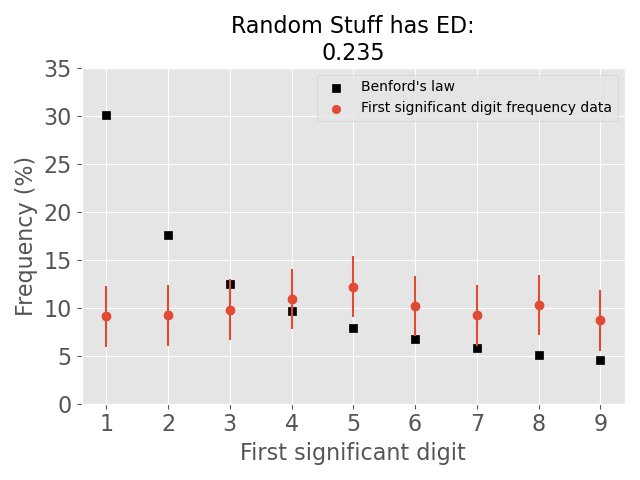

# Benford's law analysis

Benford's law is a digit-law, which states that the distribution of seperate digits in numbers follow a specific frequency.
This specific frequency is seen in many numerical datasets, as discovered by Simon Newcomb and Frank Benford.
You can find on [wikipedia] more information about this mysterious law.

Benford's law might be helpful to detect [fraud], do [science], or just investigate the [quality of data].

#### Installation
With ```pip install benfordslaw-analysis``` you will install the package.

#### Usage
Now you can do ```from benfordslaw_analysis.analysis import Analysis```.
You have now imported the class ```Analysis```.
Now you can play around with your data and test if Benford's law is hidden in your data, by inserting a list or 
a pandas series into the class object.

For example, make a plot with Benford's law versus random data with:
```
from benfordslaw_analysis.analysis import Analysis
from random import uniform
random_data = [uniform(-10, 10) for i in range(0,1000)]
bl = Analysis(random_data)
bl.plot_first_digit('Random stuff')
```


Note that we use the [Euclidean distance] between the digit frequency from Benford's law and your own data as a measure
and that we use Poisson error bars (based on the number of data points).

#### Euclidean distance

The normalized Euclidean distance is a nice way to test how Benford your data is.
This value is situated between 0 and 1, the closer to 0 the better.
However, it is not a formal statistic because it is sample size independent.
In the literature there are several other measures (Chi-square, Kolmogorov-Smirnov, ..) that are used but I noticed in my own research that 
size dependency is a limitation in bigger datasets and classifies all bigger datasets as non-Benford, even though they are Benford by eye.
More about the justification of using the Euclidean distance is explained in [this paper] in Appendix D.

#### Citing

If you find ```benfordslaw_analysis``` a useful tool for your own research, please cite in the following way:

```
@misc{benford_py,
      author = {Jurjen, de Jong},
      title = {{benfordslaw_analysis: a Python Implementation of Benford's Law analysis}},
      year = {2021},
      howpublished = {\url{https://github.com/jurjen93/Benfords_law}},
}
```

[wikipedia]: https://en.wikipedia.org/wiki/Benford%27s_law
[fraud]: https://www.journalofaccountancy.com/issues/2017/apr/excel-and-benfords-law-to-detect-fraud.html
[science]: https://towardsdatascience.com/benfords-law-in-the-gaia-universe-b5727db7a936
[quality of data]: https://www.idfcinstitute.org/blog/2020/november/using-benfords-law-to-understand-covid-19-data-quality/
[Euclidean distance]: https://en.wikipedia.org/wiki/Euclidean_distance
[my own paper]: https://www.aanda.org/articles/aa/pdf/2020/10/aa37256-19.pdf
